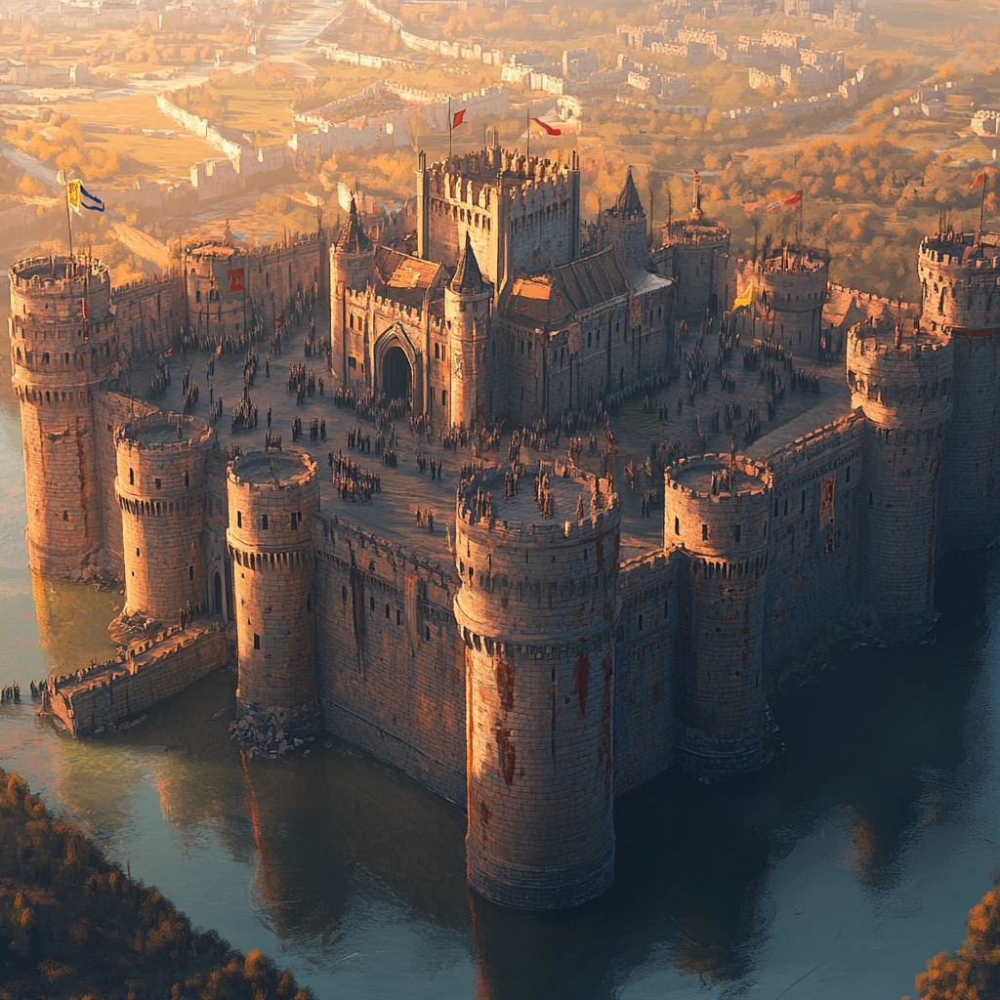

# Castles with Moats
**Castles with Moats - AI**

A creative exploration of AI-generated castles surrounded by moats. This project demonstrates the capabilities of AI tools to create visually stunning and imaginative outputs.

---

![Castle with a Moat][https://www.midjourney.com/jobs/f859ef83-bd7a-4cc3-bcae-f4d36587529f?index=0]

[Castle with a Moat - description - create a hyper realistic image of a beautiful castle of medieval period, 8kresolution](https://www.midjourney.com/jobs/813890c1-fba2-4dcd-9252-1227b2658c53?index=0)

[Castle with a Moat - Imaginative](https://www.midjourney.com/jobs/210ab05f-8d2a-4f29-a2e2-4444aecdb2f8?index=0)

---

## About the Project
This repository showcases AI-generated artwork inspired by the architectural beauty and mystery of castles with moats. The featured image is created using MidJourney, pushing the boundaries of AI in artistic creation.

## How to Use
Feel free to explore the repository to view the assets and understand the process behind generating these artworks. Contributions and suggestions are welcome!

## Tools Used
- [MidJourney](https://www.midjourney.com/): AI-powered art generation tool.
(Castle with a Moat) [0_1.jpg]
